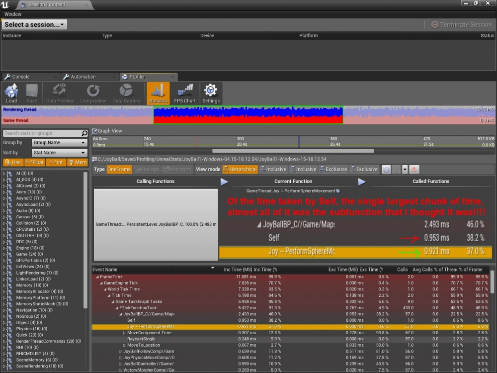

# Profiling: How to Count CPU Cycles

## Overview

In this wiki I show you how you can count the CPU cycles of individual blocks of your game code, and expose this information to a very easy-to-use UI in the UE4 Editor! This wiki shows you how to leverage all the work Epic engineers have put into the UE4 profiler, customizing it to monitor named sections of your game code! After you're done with this wiki you will be able to check on the performance of any individual lines or functions from your entire project-level code base, assigning your own chosen names to these blocks of code! Enjoy! Rama

### Pic of What This Wiki Enables You To Do



In this picture you can see I've created my own custom STAT so that the UE4 Profiler can track a specific block of my game code that I called **"Joy ~ PerformSphereMovement"**.

I've successfully tracked the CPU cycles of a section of my own project-level code base and exposed this information to the very friendly GUI of the UE4 Profiler!

Yay!

This picture shows that the UE4 Profiler has confirmed my guess that a certain block of my code was causing almost 97% \(96.6\) of the performance hit for all the character tick code in my entire code base!

It saves me hours of time to be able to easily narrow down what block of code in my rather large character code base is causing **literally 97% of the character-code performance hit!**

### UE4 Documentation on the Profiler

I assume you are familiar with the basics of the UE4 profiler in this tutorial.

If you have not yet seen what the profiler can already do for you, I recommend reading the Epic Documentation and trying it out!

[Epic Documentation on the Amazing UE4 Profiler](https://docs.unrealengine.com/en-US/Engine/Performance/Profiler/index.html)

### Running The UE4 Profiler

Type in the in-game console to Start Profile:

```text
 "stat startfile";
```

Type in the in-game console To Stop Profile

```text
 "stat stopfile";
```

### Opening Your Profiled Game Session Data in the Editor

Go to Window-&gt;Developer Tools-&gt;Session Front End

Then click on the profiler button!


Then you can load your file that you saved!

It will be under the Saved/Profiling directory :\)

Always check the date to make sure you are looking at the right file!

### Self

Now on to the core of this wiki!

You'll notice that in your game code there will be huge blocks called "Self" which indicates code that has not been divided up into cycle-counted sub-sections! This Self block is all of the code running for your in-game class instances.

Well here is how you can sub-divide Self into your own chosen named categories, neatly organizing and cateloging your own code base!

### Creating Your Own Stat Group

Let's say you have class hierachy of classes for your in-game Character.

You want to subdivide the inner workings of your entire character code into CPU cycle-counted code blocks.

In the highest level of your class structure, in the .h, declare your category

```cpp
//For UE4 Profiler ~ Stat Group
DECLARE_STATS_GROUP(TEXT("JoyBall"), STATGROUP_JoyBall, STATCAT_Advanced);
```

### Creating the Stat

In the .cpp where you want to track a particular function body, put this at the top just below the \#includes

```cpp
/*
    By Rama
*/
#include "Joy.h"
#include "JoyBall.h"

//For UE4 Profiler ~ Stat
DECLARE_CYCLE_STAT(TEXT("Joy ~ PerformSphereMovement"), STAT_PerformSphereMovement, STATGROUP_JoyBall);
```

Please note you can create as many CYCLE\_STAT's as you want for your particular STATGROUP !

And you should have one DECLARE\_CYCLE\_STAT for each function body/scope that you want to count cycles for.

### Using the Stat

At the very top of the scope of the function you want to track, put the SCOPE macro. Everything within the brackets of the scope you put the SCOPE\_CYCLE\_COUNTER in will be cycle-counted by the profiler!

```cpp
void AJoyBallMovement::PerformSphereMovement()
{
    SCOPE_CYCLE_COUNTER(STAT_PerformSphereMovement);

    //... your code that you want to test the performance of and have show up in the profiler

} //Cycle count scope ends here -Rama
```

### Counting CPU Cycles For Any Block of Code

Please note your scope can be within a single function, just make sure to give such a stat an appropriate name like YourFunction\_Internal or something Again, the SCOPE\_CYCLE\_COUNTER will cycle-count within its brackets

```cpp
void AJoyBallMovement::PerformSphereMovement()
{
    //First part of this function, code that wont be cycle counted
    ConsoleCommand("Joy");
    //... etc

    //You can scope any lines of code you want by adding brackets!
    {
        SCOPE_CYCLE_COUNTER(STAT_PerformSphereMovement);
        int32 Parameter = 200;
        YourFunctionThatYouThinkMightBeSlow(Parameter);
        //other code to cycle count

    } //Cycle count scope ends here -Rama


    //More code that wont be cycle counted
    ConsoleCommand("~~~~~");
        //... etc
}
```

### Example From My Code Base

See the picture in the overview!

In my own code base I had a 10 class inheritance hierarchy for my game character, and the UE4 profiler was simply telling me that the character "Self" was costing 37% of my total performance hit.

I used the info I am sharing with you in this wiki to create a SCOPE\_CYCLE\_COUNTER for the function that I thought was probably taking all the performance, and I was right!

But the most important thing is that I enabled the awesome UE4 Profiler to help me narrow down the performance hit in my game code to just a single function / block of code, and so with that info I can easily address the performance hit, knowing it is worth the effort to rewrite the code!

### Conclusion

You now know how you can CPU cycle-count individual lines of your game code base, and expose this information to UE4's super awesome GUI Profiler!

Enjoy!

